# Architecture — LLM Wiki

Living architecture diagrams for this project. **Update this file at the end of each phase.**

**Last updated:** 2026-06-24 — Phase 7 complete (Steps 0–7); LangGraph lint; structural + LLM checks; interactive fixes  
**Companion doc:** [dev-notes.md](dev-notes.md)

---

## 1. System overview (Phases 0–7)

What exists today: full ingest → index/log → Oracle search → query agent → multi-wiki registry → **lint health-checks with interactive fixes**. Streamlit UI is Phase 8.

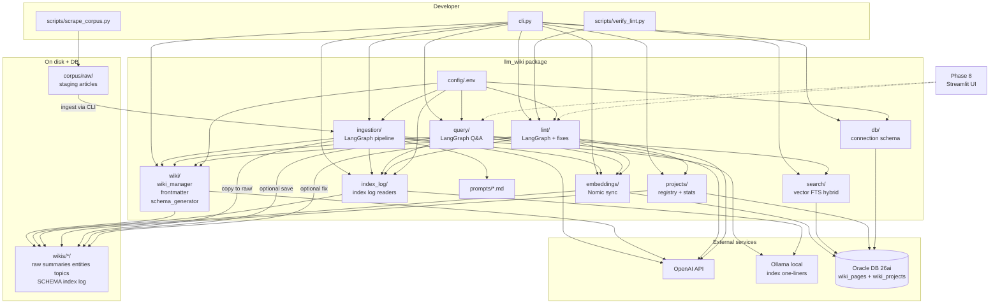

**Solid lines** = implemented (Phases 0–7). **Dotted** = planned (Phase 8 UI only).

---

## 2. Phase roadmap (challenge steps)

```mermaid
flowchart LR
    P0[Phase 0\nEnvironment] --> P1[Phase 1\nWiki scaffold]
    P1 --> P2[Phase 2\nIngestion]
    P2 --> P3[Phase 3\nIndex and log]
    P3 --> P4[Phase 4\nOracle vectors]
    P4 --> P5[Phase 5\nQuery]
    P5 --> P6[Phase 6\nMulti-wiki DB]
    P6 --> P7[Phase 7\nLint]
    P7 --> P8[Phase 8\nUI]

    style P0 fill:#2d6a4f,color:#fff
    style P1 fill:#2d6a4f,color:#fff
    style P2 fill:#2d6a4f,color:#fff
    style P3 fill:#2d6a4f,color:#fff
    style P4 fill:#2d6a4f,color:#fff
    style P5 fill:#2d6a4f,color:#fff
    style P6 fill:#2d6a4f,color:#fff
    style P7 fill:#2d6a4f,color:#fff
    style P8 fill:#40916c,color:#fff
```

| Color | Meaning |
|-------|---------|
| Dark green (`#2d6a4f`) | Done (Phases 0–7) |
| Mid green (`#40916c`) | Next up (Phase 8) |

---

## 3. Phase 0 — Environment

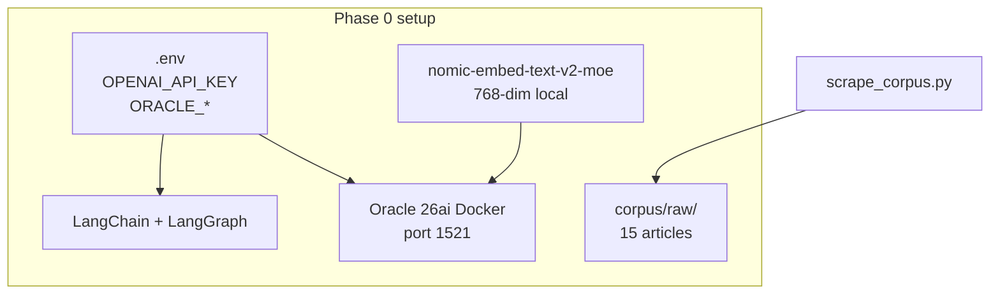

---

## 4. Phase 1 — Wiki scaffolding

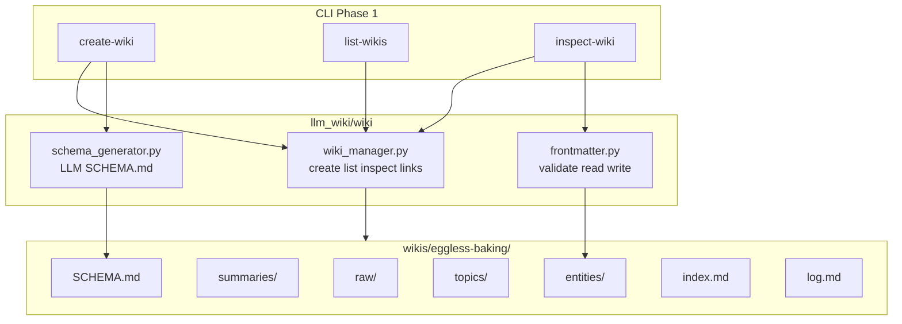

---

## 5. Phase 2 — Ingestion pipeline

### 5a. End-to-end ingest flow

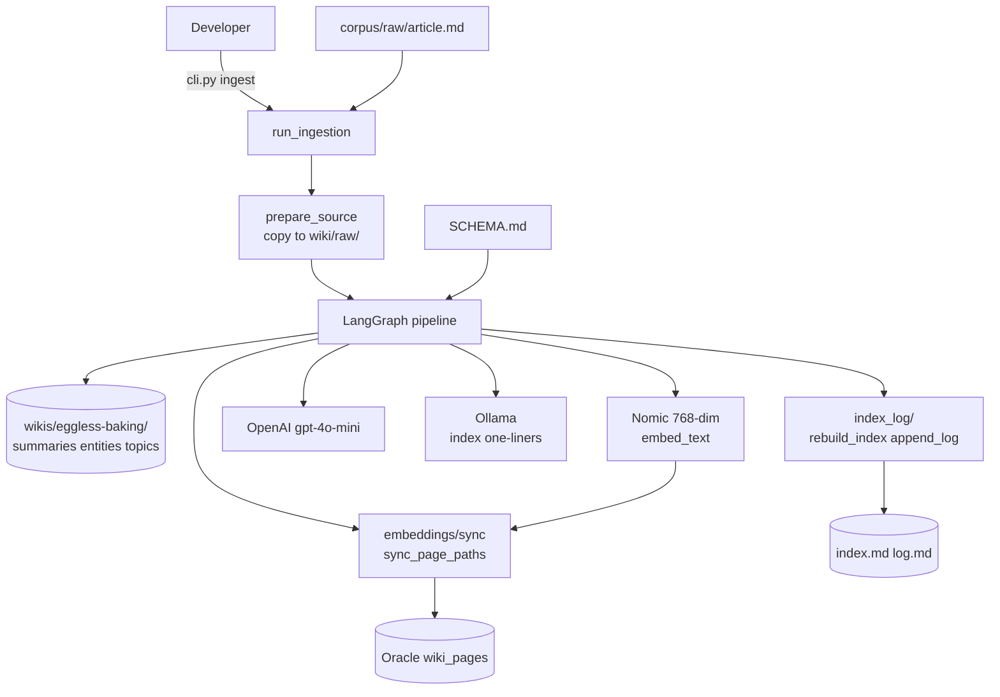

### 5b. LangGraph nodes (detailed)

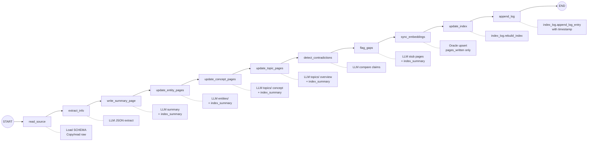

### 5c. IngestionState (shared backpack)

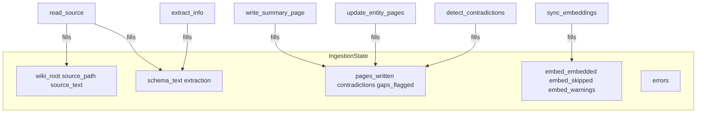

---

## 6. Wiki page model (Option A)

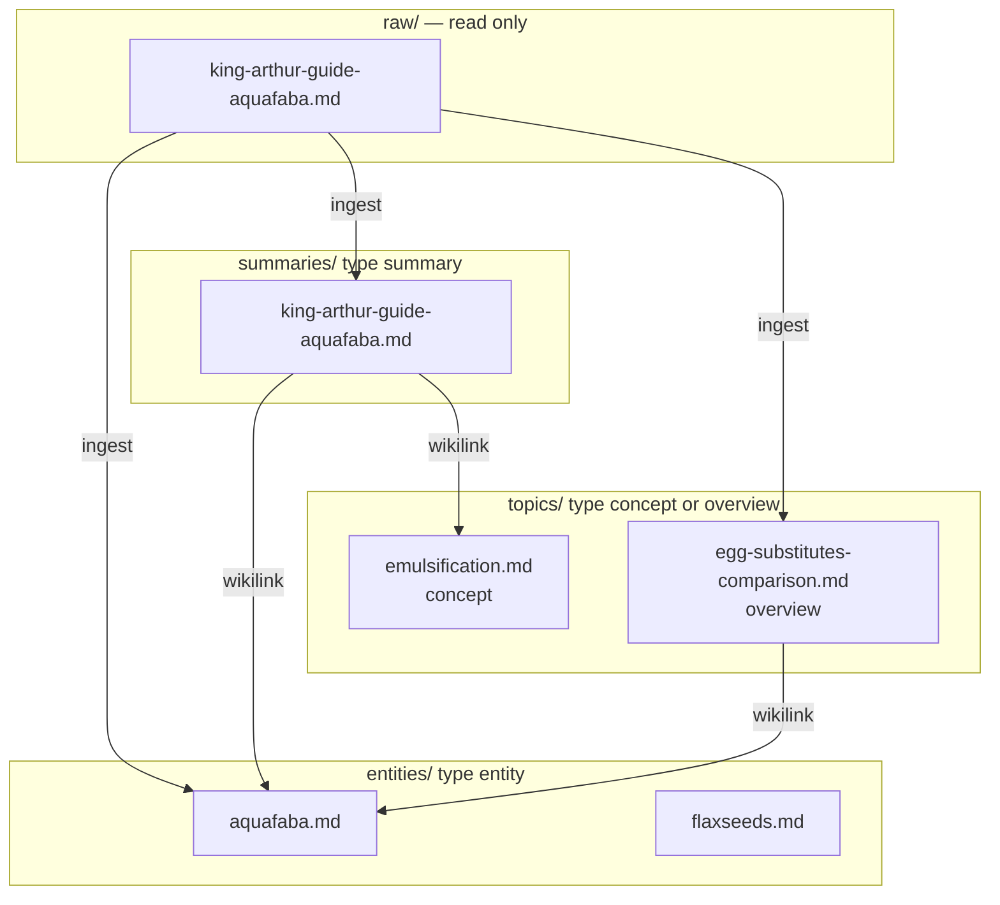

---

## 7. Data flow — corpus to wiki

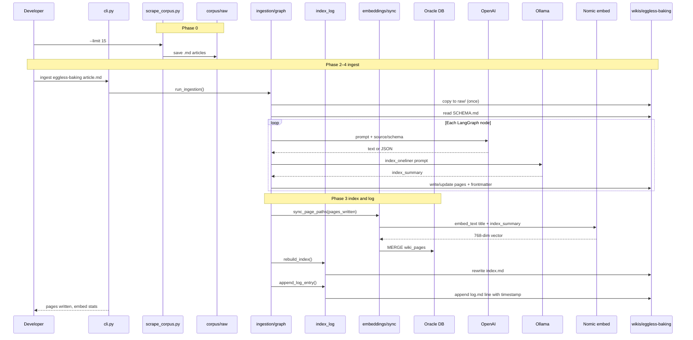

### 7b. Query flow (Phase 5)

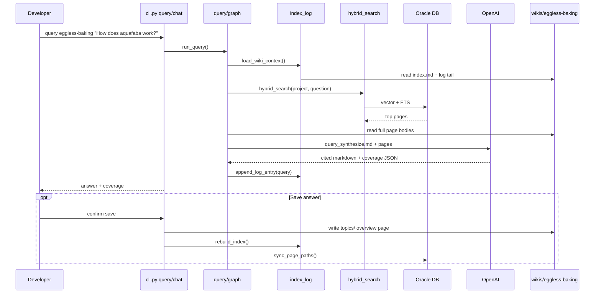

---

## 8. Phase 3 — Index & log

Extracted from ingestion nodes into `llm_wiki/index_log/`. Index rebuild is filesystem-driven (stale entries drop when pages are deleted). One-liners use a **hybrid** model: Ollama at write time → `index_summary` in frontmatter; heuristic fallback on rebuild (no LLM).

### 8a. Module layout

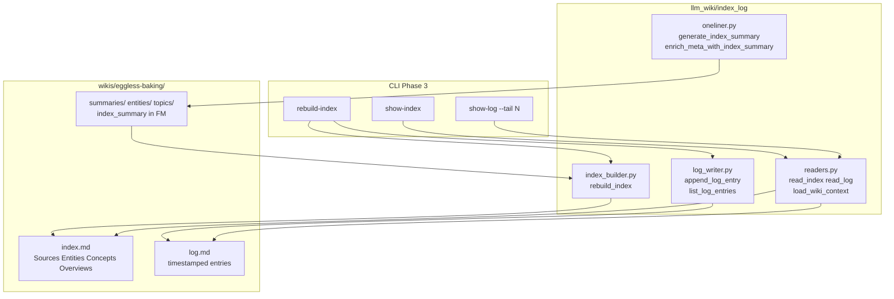

### 8b. Hybrid one-liner flow

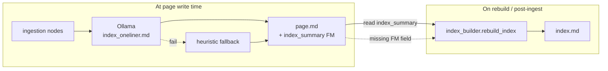

### 8c. Log format and events

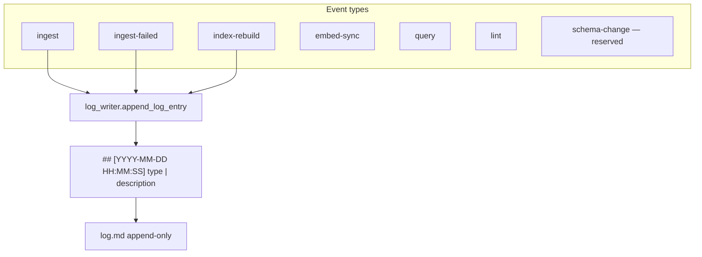

**Log format:** `## [YYYY-MM-DD HH:MM:SS] event-type | description`  
Legacy date-only entries (`## [YYYY-MM-DD] ...`) still parse.  
**Index sections:** Sources (summaries), Entities, Concepts, Overviews — each entry shows wikilink, one-liner, path, `created`, source count.

---

## 9. Phase 4 — Vector & hybrid search

Wiki pages are embedded with Nomic (`768`-dim) and stored in Oracle `wiki_pages`. Search combines vector similarity + Oracle Text via reciprocal rank fusion (RRF).

### 9a. Module layout

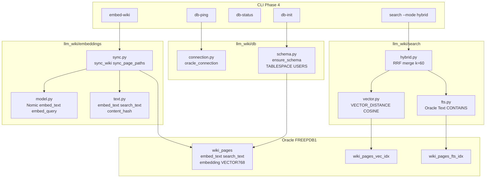

### 9b. Embed & upsert flow

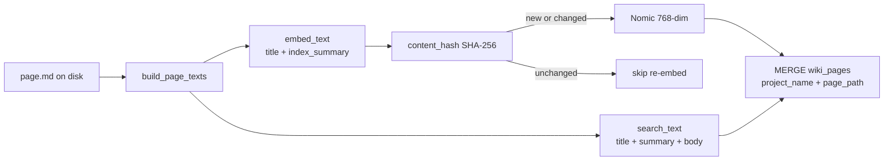

**Incremental rule:** only re-embed when `content_hash` of `embed_text` changes. Ingestion calls `sync_page_paths` for `pages_written` only; full backfill via `embed-wiki`.

### 9c. Hybrid search (RRF)

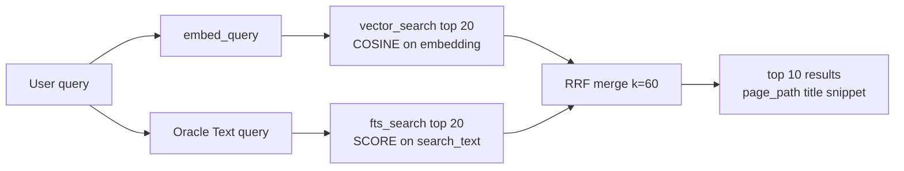

**Scope:** all searches filter `WHERE project_name = :wiki_name` (folder name, e.g. `eggless-baking`).

**Oracle setup notes:** table in `USERS` tablespace; `db-init` sets `SYSTEM` default tablespace to `USERS` for vector indexes. Set `USE_TF=0` for Nomic/Keras compatibility.

---

## 10. Phase 5 — Query system

LangGraph workflow answers questions from wiki pages only, with `[[Page Title]]` citations. Supports single-shot `query` and multi-turn `chat`; optional save back to `topics/` as an overview page.

### 10a. Module layout

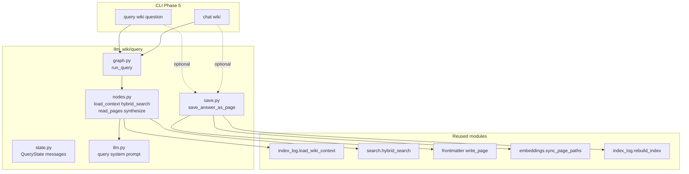

### 10b. Query graph nodes

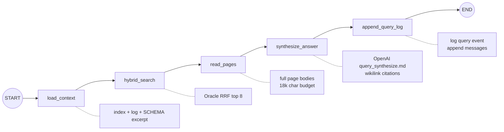

### 10c. Coverage and save-to-wiki

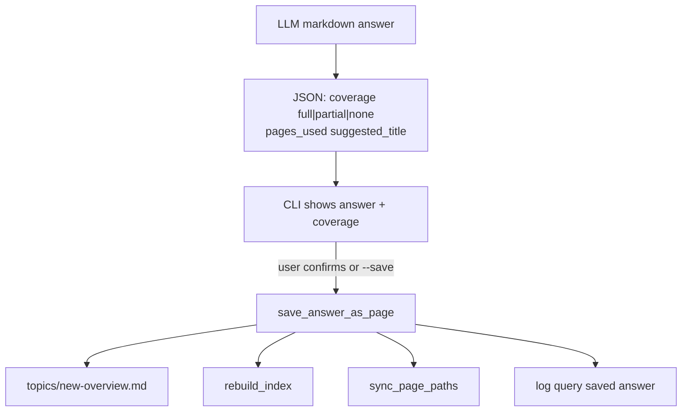

**Follow-ups:** `chat` passes accumulated `messages`; search prepends prior user question for context.  
**Honesty rule:** synthesis prompt requires admitting gaps (`coverage: none`) — no outside knowledge.

---

## 11. Phase 6 — Multi-wiki project registry

Oracle `wiki_projects` metadata + disk merge; all embed/search/query scoped by `project_name`.

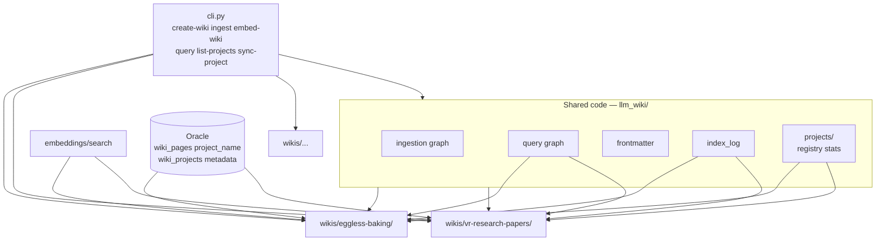

**Isolation:** searches and embeddings filter by `project_name`; empty wiki returns zero cross-wiki hits.

---

## 12. Phase 7 — Lint system

LangGraph workflow health-checks a wiki (structural + LLM analysis), prints a prioritized report, and optionally applies fixes with user approval in the CLI.

### 12a. Module layout

```mermaid
flowchart TB
    subgraph lint [llm_wiki/lint]
        State[state.py\nLintIssue LintState]
        Struct[structural.py\norphan broken link\nmissing page FM]
        LLM[llm_checks.py\ncontradiction stale gap]
        Nodes[nodes.py\ngraph node fns]
        Graph[graph.py\nrun_lint]
        Report[report.py\nformat_lint_report]
        Fixes[fixes.py\napply_fix finalize]
    end

    subgraph cli7 [CLI Phase 7]
        Lint[lint wiki\n--checks structural|llm|all]
        RO[--report-only]
        AF[--auto-fix]
    end

    subgraph shared [Reused]
        WM[wiki_manager\nwikilinks title index]
        IL[index_log rebuild log]
        EM[embeddings.sync_page_paths]
        Proj[projects.try_sync_project]
        Contr[wiki/contradictions.py]
    end

    subgraph fixtures [Verification]
        LT[wikis/lint-test/]
        VL[scripts/verify_lint.py]
    end

    Lint --> Graph
    Graph --> Struct
    Graph --> LLM
    Lint --> Report
    Lint --> Fixes
    Fixes --> WM
    Fixes --> IL
    Fixes --> EM
    Fixes --> Proj
    Fixes --> Contr
    VL --> Graph
    VL --> LT
```

### 12b. Lint graph (analysis)

```mermaid
flowchart LR
    START((START)) --> LC[load_context]
    LC --> SC[structural_checks]
    SC --> LLM[llm_checks]
    LLM --> PF[prioritize_findings]
    PF --> END((END))

    LC -.- LCd[SCHEMA + page stats]
    SC -.- SCd[wikilink graph\nno LLM]
    LLM -.- LLMd[contradiction stale\ndata gaps prompts]
    PF -.- PFd[dedupe by id\nsort severity]
```

**Check modes:** `--checks structural` (7.1), `llm` (7.2), or `all`. Nodes skip passes not selected.

### 12c. Interactive fix loop (CLI, not in graph)

```mermaid
flowchart TB
    Report[format_lint_report] --> Loop{auto_fixable issues}
    Loop -->|each issue| Preview[preview_fix]
    Preview --> Confirm{user confirms\nor --auto-fix}
    Confirm -->|yes| Apply[apply_fix by fix_kind]
    Confirm -->|no| Skip[skip]
    Apply --> Finalize[finalize_wiki_changes]
    Skip --> Loop
    Finalize --> Index[rebuild_index]
    Finalize --> Embed[sync_page_paths]
    Finalize --> Log[append_log_entry lint]
    Finalize --> Meta[try_sync_project]
```

| `fix_kind` | Issue types | MVP action |
|------------|-------------|------------|
| `create_stub` | broken link, missing page | LLM stub in `entities/` |
| `add_backlink` | orphan | Add line to `index.md` |
| `append_contradiction` | contradiction | `## Contradictions` on pages |
| `revise_claim` | stale claim | `## Revision note` on page |

**Severity order:** Critical (contradiction, stale) → Warning (orphan, links, FM) → Suggestion (data gaps + research prompts).

**Verified:** `wikis/lint-test/` fixtures + `python3 scripts/verify_lint.py` (challenge Step 7 checklist).

---

## 13. Planned architecture (Phase 8)

*Phases 0–7 are built; update this section when Phase 8 ships.*

```mermaid
flowchart TB
    subgraph done [Built — Phases 0–7]
        Ingest[Ingestion graph\n+ sync_embeddings]
        WikiFS[Wiki filesystem]
        IndexLog[index_log module]
        OllamaSvc[Ollama one-liners]
        CLI3[CLI index and log]
        DBMod[db + embeddings + search]
        OracleDB[(Oracle wiki_pages\nvector + FTS indexes)]
        CLISearch[CLI db-ping embed-wiki search]
        QueryMod[query LangGraph\nquery + chat CLI]
        SaveAns[save answer to topics/]
        Projects[wiki_projects table\nlist-projects sync-project]
        LintMod[lint LangGraph\nstructural + LLM checks\ninteractive fixes]
        LintCLI[CLI lint + verify_lint.py]
    end

    subgraph p8 [Phase 8 — next]
        UI[Streamlit web UI\nrich chat + browse]
    end

    Ingest --> WikiFS
    Ingest --> IndexLog
    Ingest --> DBMod
    Ingest --> OllamaSvc
    Ingest --> Projects
    CLI3 --> IndexLog
    CLISearch --> DBMod
    DBMod --> OracleDB
    Projects --> OracleDB
    QueryMod --> DBMod
    QueryMod --> IndexLog
    QueryMod --> SaveAns
    QueryMod --> Projects
    SaveAns --> WikiFS
    SaveAns --> DBMod
    LintMod --> WikiFS
    LintMod --> IndexLog
    LintMod --> DBMod
    LintCLI --> LintMod
    UI --> QueryMod
    UI --> LintMod
    UI --> Ingest

    style done fill:#2d6a4f,color:#fff
    style p8 fill:#40916c,color:#fff
```

---

## How to update this doc

When completing a phase:

1. Change **Last updated** at the top.
2. Update **Section 2** roadmap colors (done / partial / planned).
3. Add or expand a dedicated section with a new diagram (mirror Phase 1–2 pattern).
4. Update **Section 1** system overview — solid vs dotted lines.
5. Refine **Section 12** — move components from planned to built.
6. Note changes in [dev-notes.md](dev-notes.md) project status table.

**Preview:** Open this file in the Cursor/VS Code Markdown preview (`Cmd+Shift+V`) to render Mermaid diagrams. For ASCII fallbacks in plain terminals, ask and we can add a compact text version per section.
